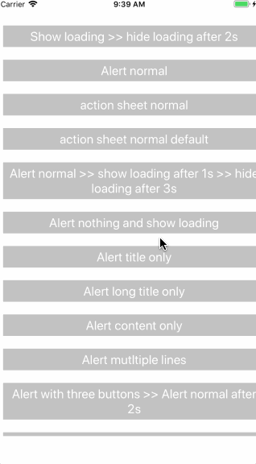
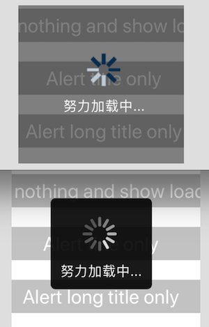

# react-native-overlayer

react-native项目中通用的浮层组件

# 功能
* **通用RRCAlert组件**
* **通用RRCLoading组件**

# install

		npm i react-native-overlayer --save

# 效果

## RRCAlert
* 引用

		import { RRCAlert } from 'react-native-overlayer';
		...
		RRCAlert.setAlertOptions({
			alertBackgroundColor: 'rgba(0,0,0,0.3)' // alert蒙层的背景色
		})
		RRCAlert.alert(title, content, buttons, callback, options);
	
	> 注意与RRCLoading的Options的设置方式的区别

* options

	|key|default value | desc |
	|:--:|:--:|:--:|
	|contentTextStyle|null|弹框content的文本样式 |

* 当 buttons.length > 2 时，弹窗中的按钮按纵向排列

## RRCLoading
* 引用

		import { RRCLoading } from 'react-native-overlayer';
		import LoadingImage from './src/loading.gif';
		...
		const options = { loadingImage: LoadingImage, text: 'gogogo' };
		RRCLoading.setLoadingOptions(options);

		RRCLoading.show();

		RRCLoading.hide();
* options

	|key|default value | desc |
	|:--:|:--:|:--:|
	| loadingImage |null|图片（gif） |
	| text |加载中...|loading框中显示的文本 |
	|loadingBackgroundColor| rgba(0,0,0,0.3) | 蒙层背景色|
	|loadingViewBackgroundColor | rgba(0,0,0,0) | loading框的颜色|

* 在android中使用gif图需要添加额外配置，在`android/app/build.gradle`中添加如下代码

		dependencies {
		  // 如果你需要支持GIF动图
		  compile 'com.facebook.fresco:animated-gif:1.3.0'
		}

## Alert和Loading同时出现

|场景|效果|
|---|---|
|多次`RRCAlert.alert()`|优先展示最后一个（倒序展示）|
|多次`RRCLoading.show()`|仅展示最后一个，`RRCLoading.hide()`时移除|
|当loading未消失时触发`RRCAlert.alert()`|优先显示loading，loading消失后显示alert|
|当alert未消失时触发`RRCLoading.show()`|优先显示loading，loading消失后显示alert|

# 核心实现
这个组件参照[teaset](https://github.com/rilyu/teaset)的[overlay](https://github.com/rilyu/teaset#overlay)来实现的，主要思路是在RN组件的最外层包了一层View（RRCTopView），本组件即是加载在RRCTopView中的视图，使用绝对布局（`position: 'absolute'`), 其核心的代码如下：

	if (!AppRegistry.registerComponentOld) {
	  AppRegistry.registerComponentOld = AppRegistry.registerComponent;
	}

	AppRegistry.registerComponent = function (appKey, componentProvider) {

	  class RootElement extends Component {
	    render() {
	      let Component = componentProvider();
	      return (
	        <RRCTopView>
	          <Component {...this.props} />
	        </RRCTopView>
	      );
	    }
	  }

	  return AppRegistry.registerComponentOld(appKey, () => RootElement);
	}
