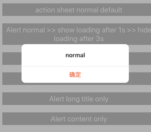
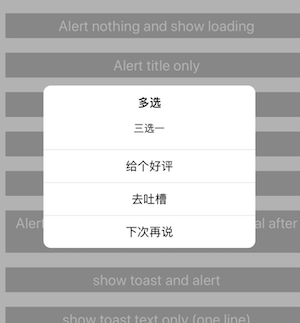
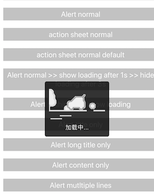
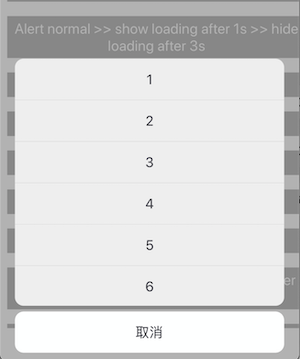
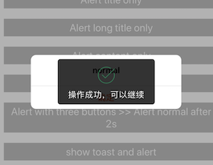
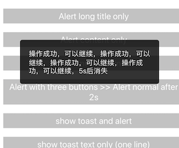

# react-native-overlayer

react-native项目中通用的浮层组件

# 功能
* **通用RRCAlert组件**
* **通用RRCLoading组件**
* **通用RRCToast组件**

* **通用RRCActionSheet组件**

# install

	npm i react-native-overlayer --save

# 效果

## RRCAlert
* 引用

		import { RRCAlert } from 'react-native-overlayer';
		...
		RRCAlert.setAlertOptions({
		  alertBackgroundColor: 'rgba(0,0,0,0.3)', // alert蒙层的背景色
		  titleViewStyle: {},
		  titleTextStyle: {},
		  contentTextStyle: {}
		})
		...
		
		cosnt buttons = [
			{ text: 'ok', style: { color: '#fd521d', fontWeight: 'bold' } }
		]
		const callback = (index)=>{
			console.log(`you click button with index ${index}`);
		}
		RRCAlert.alert('title', 'content', buttons, callback);

* **`setAlertOptions` options**

	|key|type|default value | desc |
	|:--:|:--:|:--:|:--:|
	|alertBackgroundColor|string|rgba(0,0,0,0.3)|弹框蒙层背景色 |
	|titleViewStyle|object|-|弹框标题View扩展样式 |
	|titleTextStyle|object|-|弹框标题文本扩展样式 |
	|contentTextStyle|object|-|弹框内容文本扩展样式 |

* 当 buttons.length > 2 时，弹窗中的按钮按纵向排列

## RRCActionSheet
* 引用

		import { RRCActionSheet } from 'react-native-overlayer';
		...
		RRCActionSheet.setActionSheetOptions({
		  backgroundColor: defaultBackgroundColor, // 遮罩颜色
		  fontSize: 19, // 文字字号
		  itemHeight: 57, // 单个item的高度
		  buttonTitleColor: 'rgba(0, 0, 14, 0.8)', // 备选按钮字体颜色
		  cancelButtonTitleColor: 'rgba(0, 0, 14, 0.8)', // 取消按钮字体颜色
		  buttonItemBackgroundColor: '#eee', // 备选按钮背景颜色
		  cancelButtonBackgroundColor: '#feffff', // 取消按钮背景颜色
		})
		...
		
		const buttons = [1,'2','3',4,5,6]; // 字符串或数字型数组
		const buttons_2 = [ // 对象型数组  key 为 text和style
			{text: 1, style:{color: 'red', fontSize: 16}},
			{text: 2, style:{color: 'red'}},
			{text: 2, style:{color: 'red'}},
			{text: 3, style:{color: 'red'}}
		]
		const buttons_3 = [ // 数字、字符串、对象 组合型数组
			{text: 1, style:{color: 'red'}},
			2,
			{text: 3, style:{color: 'red'}},
			{text: 4, style:{color: 'red'}},
			'5'
		]
		
		const callback = (index)=>{
			console.log(`you click button with index ${index}`);
		}
		const cancelButton = {text: '确定', style:{color: 'red'}} // 默认【取消】 样式可以通过option统一设置
		
		RRCActionSheet.action(buttons, callback, cancelButton);
		

* **`setAlertOptions` options**

	|key|type|default value | desc |
	|:--:|:--:|:--:|:--:|
	| backgroundColor |string|rgba(0,0,0,0.3)|弹框蒙层背景色 |
	| fontSize | number| 19 | 文字字号
	| itemHeight | number| 57 | 单个item的高度
	| buttonTitleColor | string | rgba(0, 0, 14, 0.8) | 备选按钮字体颜色
	| cancelButtonTitleColor |  string| #eee | 备选按钮背景颜色
	| buttonItemBackgroundColor | string| 19 | 文字字号
	| cancelButtonBackgroundColor | string | #feffff | 取消按钮背景颜色

## RRCLoading
* 引用

		import { RRCLoading } from 'react-native-overlayer';
		import LoadingImage from './src/img/loading.gif';
		...
		RRCLoading.setLoadingOptions({
			text: 'gogogo',
			loadingBackgroundColor: 'rgba(0,0,0,0.0)',
			loadingImage: LoadingImage,
			loadingViewStyle: {backgroundColor: 'rgba(0,0,0,0.8)'},
			loadingTextStyle: {}
		})

		RRCLoading.show();

		RRCLoading.hide();
		
* **`setLoadingOptions` oprions**
	
	|key|type|default value | desc |
	|:--:|:--:|:--:|:--:|
	| text |string|加载中...|loading框中显示的文本 |
	| loadingBackgroundColor |string| rgba(0,0,0,0) | 蒙层背景色|
	| loadingImage |Image| - |图片（gif） |
	| loadingViewStyle |object|-| loading框view的扩展样式|
	| loadingTextStyle |object| - | loading框的文本扩展样式|

* 在android中使用gif图需要添加额外配置，在`android/app/build.gradle`中添加如下代码

		dependencies {
		  // 如果你需要支持GIF动图
		  compile 'com.facebook.fresco:animated-gif:1.3.0'
		}
		
## RRCToast
* 引用

		import { RRCLoading } from 'react-native-overlayer';
		import AlertImage from './src/img/alert.png';
		import SuccessImage from './src/img/success.png';
		...
		RRCToast.setToastOptions({
	      toastIcons: [AlertImage, SuccessImage],
	      toastBackgroundColor: 'rgba(0,0,0,0)',
	      toastViewStyle: {},
	      toastTextStyle: {},
	      durationTime: 3000
	    })
	    ...
	    RRCToast.show(toastText, iconIndex, duration);

	> iconIndex: toast可以附带一个icon， toastIcons[iconIndex]
	
* **`setToastOptions` options**

	|key|type|default value | desc |
	|:--:|:--:|:--:|:--:|
	| toastIcons | array |-|toast附带的icon数组 |
	| toastBackgroundColor | string |rgba(0,0,0,0)|toast蒙层背景色 |
	| toastViewStyle |object|-|toast扩展样式 |
	| toastTextStyle | object |-|toast文本扩展样式 |
	| durationTime |number| 200 |toast展示的时长 |

## Alert和Loading同时出现

|场景|效果|
|---|---|
|多次`RRCAlert.alert()`|优先展示最后一个（倒序展示）|
|多次`RRCLoading.show()`|仅展示最后一个，`RRCLoading.hide()`时移除|
|当loading未消失时触发`RRCAlert.alert()`|优先显示loading，loading消失后显示alert|
|当alert未消失时触发`RRCLoading.show()`|优先显示loading，loading消失后显示alert|

# 核心实现
这个组件参照[teaset](https://github.com/rilyu/teaset)的[overlay](https://github.com/rilyu/teaset#overlay)来实现的，主要思路是在RN组件的最外层包了一层View（RRCTopView），本组件即是加载在RRCTopView中的视图，使用绝对布局（`position: 'absolute'`), 其核心的代码如下：

	if (!AppRegistry.registerComponentOld) {
	  AppRegistry.registerComponentOld = AppRegistry.registerComponent;
	}

	AppRegistry.registerComponent = function (appKey, componentProvider) {

	  class RootElement extends Component {
	    render() {
	      let Component = componentProvider();
	      return (
	        <RRCTopView>
	          <Component {...this.props} />
	        </RRCTopView>
	      );
	    }
	  }

	  return AppRegistry.registerComponentOld(appKey, () => RootElement);
	}
	
# 更新说明
### 0.1.0
- 新增`RRCToast`
- `RRCAlert.alert()`不再接收`options`参数
- 各个组件统一使用`set***Options`的方式设置属性、样式

### 0.1.1
- `RRCToast`出现时可以进行toast之外的交互，如点击事件、侧滑返回等

### 0.2.0
- 新增`RRCActionSheet`，用法与RRCAlert类似

# 效果图

